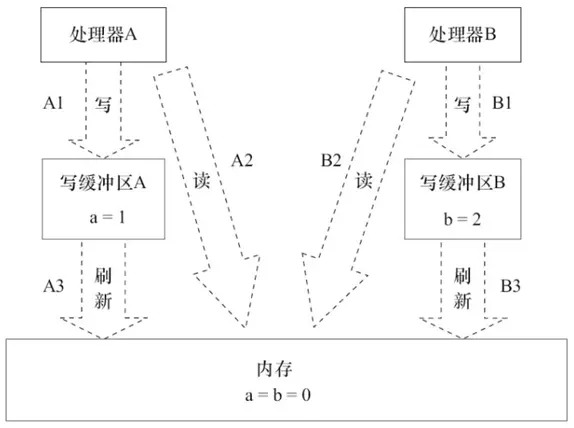

# Java内存模型

## 1.并发编程领域的关键问题

### 1.1 线程之间的通信

线程的通信是指线程之间以何种机制来交换信息。在编程中，线程之间的通信机制有两种，共享内存和消息传递。  
 在共享内存的并发模型里，线程之间共享程序的公共状态，线程之间通过写-读内存中的公共状态来隐式进行通信，典型的共享内存通信方式就是通过共享对象进行通信。  
 在消息传递的并发模型里，线程之间没有公共状态，线程之间必须通过明确的发送消息来显式进行通信，在java中典型的消息传递方式就是wait\(\)和notify\(\)。

### 1.2 线程间的同步

同步是指程序用于控制不同线程之间操作发生相对顺序的机制。  
 在共享内存并发模型里，同步是显式进行的。程序员必须显式指定某个方法或某段代码需要在线程之间互斥执行。  
 在消息传递的并发模型里，由于消息的发送必须在消息的接收之前，因此同步是隐式进行的。

## 2.Java内存模型——JMM

**Java的并发采用的是共享内存模型**

### 2.1 现代计算机的内存模型

物理计算机中的并发问题，物理机遇到的并发问题与虚拟机中的情况有不少相似之处，物理机对并发的处理方案对于虚拟机的实现也有相当大的参考意义。

其中一个重要的复杂性来源是绝大多数的运算任务都不可能只靠处理器“计算”就能完成，处理器至少要与内存交互，如读取运算数据、存储运算结果等，这个I/O操作是很难消除的（无法仅靠寄存器来完成所有运算任务）。早期计算机中cpu和内存的速度是差不多的，但在现代计算机中，cpu的指令速度远超内存的存取速度,由于计算机的存储设备与处理器的运算速度有几个数量级的差距，所以现代计算机系统都不得不加入一层读写速度尽可能接近处理器运算速度的高速缓存（Cache）来作为内存与处理器之间的缓冲：将运算需要使用到的数据复制到缓存中，让运算能快速进行，当运算结束后再从缓存同步回内存之中，这样处理器就无须等待缓慢的内存读写了。

基于高速缓存的存储交互很好地解决了处理器与内存的速度矛盾，但是也为计算机系统带来更高的复杂度，因为它引入了一个新的问题：缓存一致性（Cache Coherence）。在多处理器系统中，每个处理器都有自己的高速缓存，而它们又共享同一主内存（MainMemory）。当多个处理器的运算任务都涉及同一块主内存区域时，将可能导致各自的缓存数据不一致，举例说明变量在多个CPU之间的共享。如果真的发生这种情况，那同步回到主内存时以谁的缓存数据为准呢？为了解决一致性的问题，需要各个处理器访问缓存时都遵循一些协议，在读写时要根据协议来进行操作，这类协议有MSI、MESI（Illinois Protocol）、MOSI、Synapse、Firefly及Dragon Protocol等。


**该内存模型带来的问题** 

现代的处理器使用写缓冲区临时保存向内存写入的数据。写缓冲区可以保证指令流水线持续运行，它可以避免由于处理器停顿下来等待向内存写入数据而产生的延迟。同时，通过以批处理的方式刷新写缓冲区，以及合并写缓冲区中对同一内存地址的多次写，减少对内存总线的占用。虽然写缓冲区有这么多好处，但每个处理器上的写缓冲区，仅仅对它所在的处理器可见。这个特性会对内存操作的执行顺序产生重要的影响：处理器对内存的读/写操作的执行顺序，不一定与内存实际发生的读/写操作顺序一致！ 处理器A和处理器B按程序的顺序并行执行内存访问，最终可能得到x=y=0的结果。 处理器A和处理器B可以同时把共享变量写入自己的写缓冲区（A1，B1），然后从内存中读取另一个共享变量（A2，B2），最后才把自己写缓存区中保存的脏数据刷新到内存中（A3，B3）。当以这种时序执行时，程序就可以得到x=y=0的结果。 从内存操作实际发生的顺序来看，直到处理器A执行A3来刷新自己的写缓存区，写操作A1才算真正执行了。虽然处理器A执行内存操作的顺序为：A1→A2，但内存操作实际发生的顺序却是A2→A1。




### 2.2 Java内存模型（JMM）

JMM定义了Java 虚拟机\(JVM\)在计算机内存\(RAM\)中的工作方式。JVM是整个计算机虚拟模型，所以JMM是隶属于JVM的。从抽象的角度来看，JMM定义了线程和主内存之间的抽象关系：线程之间的共享变量存储在主内存（Main Memory）中，每个线程都有一个私有的本地内存（Local Memory），本地内存中存储了该线程以读/写共享变量的副本。本地内存是JMM的一个抽象概念，并不真实存在。它涵盖了缓存、写缓冲区、寄存器以及其他的硬件和编译器优化。  


#### 2.2.1 JVM对Java内存模型的实现

* 在JVM内部，Java内存模型把内存分成了两部分：线程栈区和堆区  JVM中运行的每个线程都拥有自己的线程栈，线程栈包含了当前线程执行的方法调用相关信息，我们也把它称作调用栈。随着代码的不断执行，调用栈会不断变化。


所有基本类型\(boolean,byte,short,char,int,long,float,double\)的局部变量都直接保存在线程栈当中，对于它们的值各个线程之间都是独立的。对于基本类型的局部变量，一个线程可以传递一个副本给另一个线程，当它们之间是无法共享的。 堆区包含了Java应用创建的所有对象信息，不管对象是哪个线程创建的，其中的对象包括基本类型的封装类（如Byte、Integer、Long等等）。不管对象是属于一个成员变量还是方法中的局部变量，它都会被存储在堆区。 一个局部变量如果是基本类型，那么它会被完全存储到栈区。 一个局部变量也有可能是一个对象的引用，这种情况下，这个本地引用会被存储到栈中，但是对象本身仍然存储在堆区。 对于一个对象的成员方法，这些方法中包含局部变量，仍需要存储在栈区，即使它们所属的对象在堆区。 对于一个对象的成员变量，不管它是基本类型还是包装类型，都会被存储到堆区。Static类型的变量以及类本身相关信息都会随着类本身存储在堆区。


### 2.3 Java内存模型带来的问题

#### 2.3.1 可见性问题

CPU中运行的线程从主存中拷贝共享对象obj到它的CPU缓存，把对象obj的count变量改为2。但这个变更对运行在右边CPU中的线程不可见，因为这个更改还没有flush到主存中：要解决共享对象可见性这个问题，我们可以使用java volatile关键字或者是加锁  


#### 2.3.2 竞争现象

线程A和线程B共享一个对象obj。假设线程A从主存读取Obj.count变量到自己的CPU缓存，同时，线程B也读取了Obj.count变量到它的CPU缓存，并且这两个线程都对Obj.count做了加1操作。此时，Obj.count加1操作被执行了两次，不过都在不同的CPU缓存中。如果这两个加1操作是串行执行的，那么Obj.count变量便会在原始值上加2，最终主存中的Obj.count的值会是3。然而下图中两个加1操作是并行的，不管是线程A还是线程B先flush计算结果到主存，最终主存中的Obj.count只会增加1次变成2，尽管一共有两次加1操作。 要解决上面的问题我们可以使用java synchronized代码块。


### 2.4 Java内存模型中的重排序

* 在执行程序时，为了提高性能，编译器和处理器常常会对指令做重排序。

#### 2.4.1 重排序类型


* 1）编译器优化的重排序。编译器在不改变单线程程序语义的前提下，可以重新安排语句的执行顺序。
* 2）指令级并行的重排序。现代处理器采用了指令级并行技术（Instruction-LevelParallelism，ILP）来将多条指令重叠执行。如果不存在数据依赖性，处理器可以改变语句对应机器指令的执行顺序。
* 3）内存系统的重排序。由于处理器使用缓存和读/写缓冲区，这使得加载和存储操作看上去可能是在乱序执行。

#### 2.4.2 重排序与依赖性

* 数据依赖性  如果两个操作访问同一个变量，且这两个操作中有一个为写操作，此时这两个操作之间就存在数据依赖性。数据依赖分为下列3种类型，这3种情况，只要重排序两个操作的执行顺序，程序的执行结果就会被改变。

| 名称 | 代码示例 | 说明 |
| :--- | :--- | :--- |
| 写后读 | a=1; b=a; | 写一个变量后再读这个位置 |
| 写后写 | a=1;a=2; | 写一个变量后，再写这个变量； |
| 读后写 | a=b;b=1; | 读一个变量后再写这个变量 |

* 控制依赖性

flag变量是个标记，用来标识变量a是否已被写入，在use方法中比变量i依赖if \(flag\)的判断，这里就叫控制依赖，如果发生了重排序，结果就不对了。

```text
public void use() {
    if (flag) {
       int i = a * a;
    }
}
```

* as-if-serial 

不管如何重排序，都必须保证代码在单线程下的运行正确，连单线程下都无法正确，更不用讨论多线程并发的情况，所以就提出了一个as-if-serial的概念。 as-if-serial语义的意思是：不管怎么重排序（编译器和处理器为了提高并行度），（单线程）程序的执行结果不能被改变。编译器、runtime和处理器都必须遵守as-if-serial语义。为了遵守as-if-serial语义，编译器和处理器不会对存在数据依赖关系的操作做重排序，因为这种重排序会改变执行结果。（强调一下，这里所说的数据依赖性仅针对单个处理器中执行的指令序列和单个线程中执行的操作，不同处理器之间和不同线程之间的数据依赖性不被编译器和处理器考虑。）但是，如果操作之间不存在数据依赖关系，这些操作依然可能被编译器和处理器重排序。

```text
{
   int a = 1; //1
   int b = 2; //2
   int c = a + b; //3
}
```

1和3之间存在数据依赖关系，同时2和3之间也存在数据依赖关系。因此在最终执行的指令序列中，3不能被重排序到1和2的前面（3排到1和2的前面，程序的结果将会被改变）。但1和2之间没有数据依赖关系，编译器和处理器可以重排序1和2之间的执行顺序。 as-if-serial语义使单线程下无需担心重排序的干扰，也无需担心内存可见性问题。

#### 2.4.3 并发下重排序带来的问题


这里假设有两个线程A和B，A首先执行init \(\)方法，随后B线程接着执行use \(\)方法。线程B在执行操作4时，能否看到线程A在操作1对共享变量a的写入呢？答案是：不一定能看到。 由于操作1和操作2没有数据依赖关系，编译器和处理器可以对这两个操作重排序；同样，操作3和操作4没有数据依赖关系，编译器和处理器也可以对这两个操作重排序。让我们先来看看，当操作1和操作2重排序时，可能会产生什么效果？操作1和操作2做了重排序。程序执行时，线程A首先写标记变量flag，随后线程B读这个变量。由于条件判断为真，线程B将读取变量a。此时，变量a还没有被线程A写入，这时就会发生错误！ 当操作3和操作4重排序时会产生什么效果？ 在程序中，操作3和操作4存在控制依赖关系。当代码中存在控制依赖性时，会影响指令序列执行的并行度。为此，编译器和处理器会采用猜测（Speculation）执行来克服控制相关性对并行度的影响。以处理器的猜测执行为例，执行线程B的处理器可以提前读取并计算a\*a，然后把计算结果临时保存到一个名为重排序缓冲（Reorder Buffer，ROB）的硬件缓存中。当操作3的条件判断为真时，就把该计算结果写入变量i中。猜测执行实质上对操作3和4做了重排序，问题在于这时候，a的值还没被线程A赋值。在单线程程序中，对存在控制依赖的操作重排序，不会改变执行结果（这也是as-if-serial语义允许对存在控制依赖的操作做重排序的原因）；但在多线程程序中，对存在控制依赖的操作重排序，可能会改变程序的执行结果。

#### 2.4.4 解决在并发下的问题

1. **内存屏障——禁止重排序**

| 屏障类型 | 指令示例 | 说明 |
| :---: | :--- | :--- |
| LoadLoad Barriers | Load1;LoadLoad;Load2 | 确保Load1数据的装载之前与Load2及所有后续装载指令的装载 |
| StoreStore Barriers | Store1;StoreStore;Store2; | 确保Store1数据对其他处理器可见（刷新到内存），之前于Store2及所有后续存储指令的存储 |
| LoadStore Barriers | Load1; LoadStore; Store2; | 确保Load1数据装载，之前于Store2及所有后续存储指令的存储 |
| StoreLoad Barriers | Store1;StoreLoad;Load2 | 确保Store1数据对其他处理器可见（刷新到内存），之前于Load2及所有后续装载指令的装载，StoreLoad Barriers会使该屏障之前的内存访问指令（存储和装载指令）完成之后，才执行该屏障之后的内存访问指令 |

Java编译器在生成指令序列的适当位置会插入内存屏障指令来禁止特定类型的处理器重排序，从而让程序按我们预想的流程去执行。

 1、保证特定操作的执行顺序。 

2、影响某些数据（或则是某条指令的执行结果）的内存可见性。

编译器和CPU能够重排序指令，保证最终相同的结果，尝试优化性能。插入一条Memory Barrier会告诉编译器和CPU：不管什么指令都不能和这条Memory Barrier指令重排序。 Memory Barrier所做的另外一件事是强制刷出各种CPU cache，如一个Write-Barrier（写入屏障）将刷出所有在Barrier之前写入 cache 的数据，因此，任何CPU上的线程都能读取到这些数据的最新版本。 JMM把内存屏障指令分为4类，解释表格，StoreLoad Barriers是一个“全能型”的屏障，它同时具有其他3个屏障的效果。现代的多处理器大多支持该屏障（其他类型的屏障不一定被所有处理器支持）。

**2）临界区（synchronized？）**


临界区内的代码可以重排序（但JMM不允许临界区内的代码“逸出”到临界区之外，那样会破坏监视器的语义）。JMM会在退出临界区和进入临界区这两个关键时间点做一些特别处理，虽然线程A在临界区内做了重排序，但由于监视器互斥执行的特性，这里的线程B根本无法“观察”到线程A在临界区内的重排序。这种重排序既提高了执行效率，又没有改变程序的执行结果

### 2.5 Happens-Before

用happens-before的概念来阐述操作之间的内存可见性。在JMM中，如果一个操作执行的结果需要对另一个操作可见，那么这两个操作之间必须要存在happens-before关系 。

两个操作之间具有happens-before关系，并不意味着前一个操作必须要在后一个操作之前执行！happens-before仅仅要求前一个操作（执行的结果）对后一个操作可见，且前一个操作按顺序排在第二个操作之前（the first is visible to and ordered before the second） 。

1）如果一个操作happens-before另一个操作，那么第一个操作的执行结果将对第二个操作可见，而且第一个操作的执行顺序排在第二个操作之前。\(对程序员来说\)

2）两个操作之间存在happens-before关系，并不意味着Java平台的具体实现必须要按照happens-before关系指定的顺序来执行。如果重排序之后的执行结果，与按happens-before关系来执行的结果一致，那么这种重排序是允许的\(对编译器和处理器 来说\)

在Java 规范提案中为让大家理解内存可见性的这个概念，提出了happens-before的概念来阐述操作之间的内存可见性。对应Java程序员来说，理解happens-before是理解JMM的关键。JMM这么做的原因是：程序员对于这两个操作是否真的被重排序并不关心，程序员关心的是程序执行时的语义不能被改变（即执行结果不能被改变）。因此，happens-before关系本质上和as-if-serial语义是一回事。as-if-serial语义保证单线程内程序的执行结果不被改变，happens-before关系保证正确同步的多线程程序的执行结果不被改变。


#### Happens-Before规则-无需任何同步手段就可以保

1. 程序顺序规则：一个线程中的每个操作，happens-before于该线程中的任意后续操作。 
2. 监视器锁规则：对一个锁的解锁，happens-before于随后对这个锁的加锁。
3. volatile变量规则：对一个volatile域的写，happens-before于任意后续对这个volatile域的读。
4. 传递性：如果A happens-before B，且B happens-before C，那么A happens-before C。 
5. start\(\)规则：如果线程A执行操作ThreadB.start\(\)（启动线程B），那么A线程的ThreadB.start\(\)操作happens-before于线程B中的任意操作。 
6. join\(\)规则：如果线程A执行操作ThreadB.join\(\)并成功返回，那么线程B中的任意操作happens-before于线程A从ThreadB.join\(\)操作成功返回。
7. 线程中断规则:对线程interrupt方法的调用happens-before于被中断线程的代码检测到中断事件的发生。

## 3.实现原理

#### 内存语义：可以简单理解为 volatile，synchronize，atomic，lock 之类的在 JVM 中的内存方面实现原则

volatile变量自身具有下列特性：

* 可见性。对一个volatile变量的读，总是能看到（任意线程）对这个volatile变量最后的写入
* 原子性：对任意单个volatile变量的读/写具有原子性，但类似于volatile++这种复合操作不具有原子性。

volatile写的内存语义如下：当写一个volatile变量时，JMM会把该线程对应的本地内存中的共享变量值刷新到主内存。


volatile读的内存语义如下：当读一个volatile变量时，JMM会把该线程对应的本地内存置为无效。线程接下来将从主内存中读取共享变量。


volatile重排序规则：


